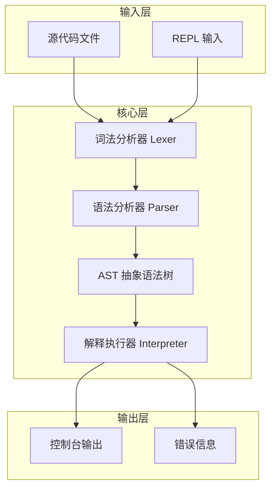

# Regula

> 一门语法**高度统一**、**结构化的静态强类型**语言，名称源自拉丁语 *regula*，  意为**规则、范式、法度**，源码后缀为`.rul`

---

## 目录

[项目介绍](#项目介绍)

[设计目标](#设计目标)

[项目架构](#项目架构)

[快速使用](#快速使用)

---

## 项目介绍

**Regula**是一门由一个人从零开发的自定义编程语言，使用`Rust`实现

目前包含：

- 词法分析（Lexer）

本语言面向**高性能**、**简洁**、**实验性语言设计**。

---

## 设计目标

- 语法干净、无歧义、直观

- 跨平台（`Linux` / `Windows` / `macOS`)

- 运行高效

---

## 项目架构



---

## 快速使用

#### 编译

```bash
cargo build --release
```

#### 启动 REPL

```bash
cargo run --release
```

#### 运行源码文件

```bash
cargo run --release demo.rul
```

## 开源协议

MIT License


